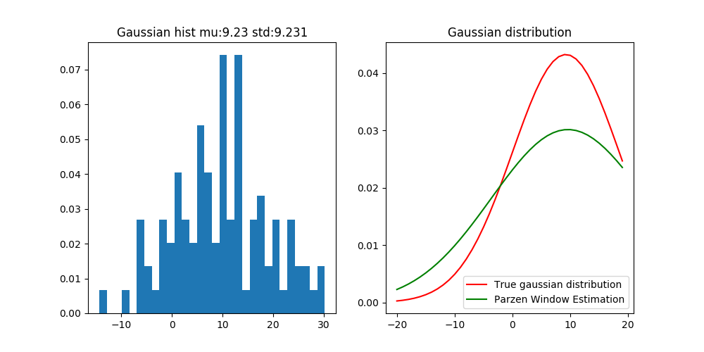

###代码说明
#####安装依赖:
    pip install -r requirements.txt

#####运行输入说明：
```
seed:   # 输入生成数据的随机种子     int
mu:     # 输入高斯分布的均值        float
std:    # 输入高斯分布的标准差      float
num of samples: # 随机取样点的个数  int
```
#####结果说明:

左图是根据(u,std)所随机取样点的直方图分布，右图红色是高斯分布(u,std)的真实概率密布，绿色是根据Parzen Windows Density Estimation得到的采样点的概率密度分布结果。
